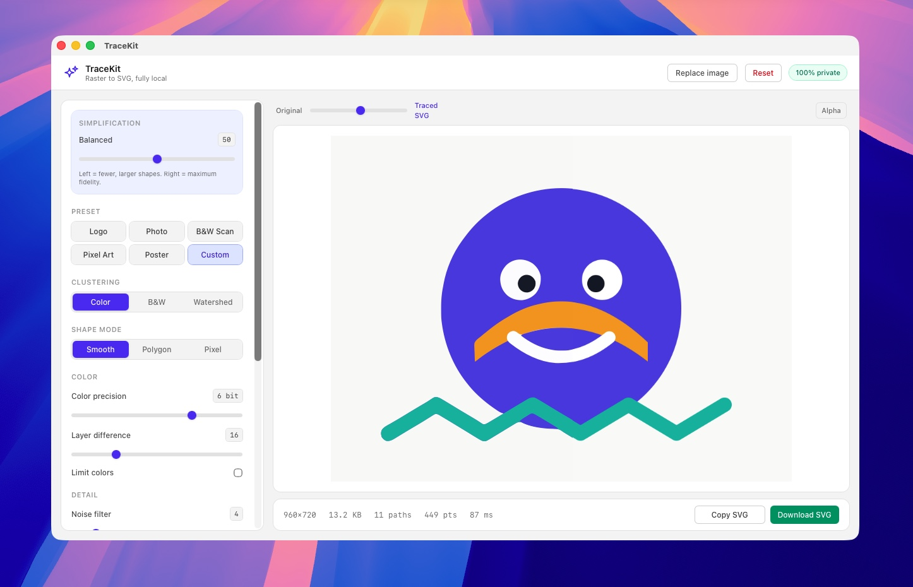

# TraceKit

<p align="center">
  
</p>

**Free, private raster-to-SVG vectorization** — an Illustrator-style Image Trace that runs entirely on your device. Powered by the [VTracer](https://github.com/visioncortex/vtracer) engine compiled to WebAssembly. No uploads, no accounts, no watermarks, no tracking.

<p align="center">
  
</p>

Works as a **browser app** and a **native macOS desktop app** (Windows/Linux builds possible via Tauri).

## Why TraceKit?

- **100% private** — images are processed in-process; nothing ever leaves your machine
- **Free & open source** — MIT licensed, no feature paywalls
- **Illustrator-style controls** — presets plus full manual tuning
- **Point-level simplification** — collapse noisy traces into clean, editable vectors
- **Tiny & fast** — 8 MB native app, WASM-accelerated tracing in a background worker
- **LAN-friendly web mode** — dev server binds `0.0.0.0` so you can trace from any device on your network

## Features

| | |
|---|---|
| Input | Drag & drop, file picker, clipboard paste — PNG · JPG · WebP · GIF · BMP |
| Presets | Logo · Photo · B&W Scan · Pixel Art · Poster |
| Clustering | Color clustering, adaptive B&W thresholding, watershed regions |
| Color control | Bit precision, layer difference, max-color quantization |
| Simplification | Master detail dial + Illustrator-style *Simplify points* tolerance |
| Geometry | Spline/polygon/pixel modes, corner & splice thresholds, segment length |
| Output | Live A/B compare slider, path/point/file-size stats, SVG download & copy |

## Getting started (web)

Requires Node.js ≥ 20 and pnpm ≥ 9.

```sh
pnpm install
pnpm dev          # http://localhost:5173 (also exposed on your LAN IP)
```

## Building the macOS app

Requires Rust (`rustup`) — the Tauri CLI bootstraps everything else.

```sh
pnpm install
pnpm app:build    # → apps/web/src-tauri/target/release/bundle/
```

Artifacts:

```
bundle/macos/TraceKit.app                    # native app (~8 MB)
bundle/dmg/TraceKit_<version>_aarch64.dmg    # disk image for distribution
```

Run during development with hot reload:

```sh
pnpm app:dev
```

> The bundled app is ad-hoc signed. To distribute outside your machine without Gatekeeper warnings you'll need to codesign with a Developer ID and notarize.

## Scripts

| Command | What it does |
| --- | --- |
| `pnpm dev` | Web dev server with HMR |
| `pnpm build` | Type-check + production web build |
| `pnpm preview` | Serve the production web build locally |
| `pnpm app:dev` | Desktop app in dev mode |
| `pnpm app:build` | Build `.app` + `.dmg` for macOS |
| `pnpm test` | Vitest unit tests |
| `pnpm lint` | ESLint |
| `pnpm typecheck` | TypeScript checks |
| `pnpm build:wasm` | Rebuild vendored WASM bindings from upstream VTracer |

## Architecture

```
apps/web                     UI: Vite + React + TS + Tailwind
└── src-tauri                Native macOS shell (Tauri v2)
packages/tracer-core         Engine wrapper — reusable by future Figma plugin / CLI
├── src/config.ts            TraceConfig types, clamping, engine mapping, detail dial
├── src/presets.ts           Tuned presets
├── src/protocol.ts          Worker message contract
├── src/client.ts            TracerClient — cancellable worker jobs
├── src/worker.ts            Web Worker hosting the WASM engine
├── src/image.ts             Blob → ImageData decoding with resolution cap
├── src/postprocess.ts       SVG stats (bytes/paths/anchor points) & cleanup
└── src/wasm/                Vendored wasm-pack output (web target)
```

Pipeline: `File → createImageBitmap → OffscreenCanvas → ImageData → Web Worker → vtracer-wasm → SVG → blob-URL preview / download`.

The vendored WASM is committed so contributors don't need a Rust toolchain for web work; run `pnpm build:wasm` to refresh it from upstream.

## Contributing

Issues and PRs welcome! Keep PRs focused; run `pnpm test && pnpm lint` before submitting.

## License

[MIT](LICENSE) © TraceKit contributors

VTracer is dual-licensed MIT OR Apache-2.0 — see [visioncortex/vtracer](https://github.com/visioncortex/vtracer).
